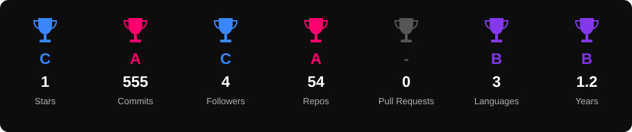

<div align="center">

<!-- 🌈 ANIMATED RAINBOW HEADER -->


<!-- ⌨️ ANIMATED TYPING SVG -->


<br/><br/>

<!-- 🔥 PROFILE BADGES -->


&nbsp;

&nbsp;

&nbsp;


</div>

---


##    About Me


```javascript
🌈 const aman = {

  👤  name         : "Aman Raj",
  📍  from         : "India 🇮🇳",
  🎓  education    : "B.Tech Computer Science",
  🏅  certification: "AWS Certified AI Practitioner",
  💻  learning     : ["C++", "DSA", "Web Development", "SQL"],
  🤖  exploring    : ["LLM", "vLLM", "GenAI", "Neural Networks"],
  🛠️  skills       : ["Java", "Python", "Linux", "Git", "GitHub"],
  🌱  growing      : "Software Developer",
  🎯  goal         : "Build. Learn. Create. Repeat. 🚀",
  ☕  fuel         : "Coffee + Code = Magic",
  😄  funFact      : "I debug until it works!",
  📫  reach        : "amantk2205@gmail.com"

};
```

<br clear="right"/>

---


## 🏅 Certifications & Achievements

<div align="center">

### ☁️ AWS Certified AI Practitioner

<a href="https://aws.amazon.com/certification/certified-ai-practitioner/" target="_blank">

</a>

<br/><br/>

**Certified in foundational Artificial Intelligence, Machine Learning & Generative AI concepts on AWS.** 🤖☁️

<br/>


</div>

---


## 🏆 Trophy Cabinet

<div align="center">

<!-- Generated by .github/workflows/metrics.yml -->


</div>

---


## 🎨 Tech Stack — My Colorful Arsenal

<div align="center">

### 🌐 Web Technologies


### 💻 Programming Languages


### 🤖 AI & Machine Learning


### 🧰 Tools & DevOps


### 🗄️ Database


### 📚 Currently Learning


</div>

---


## 📊 GitHub Stats — By The Numbers

<div align="center">

<!-- Generated by .github/workflows/metrics.yml (lives in your repo, never goes down) -->


<br/><br/>

<!-- Streak stats: old herokuapp.com host is dead, demolab is the working one -->


</div>

---


## 📈 Contribution Graph

<div align="center">

<!-- Generated by .github/workflows/metrics.yml -->


</div>

---


## 🐍 Watch My Contributions Get Eaten!

<div align="center">

<!-- Generated by .github/workflows/snake.yml into the "output" branch -->
<picture>
  <source media="(prefers-color-scheme: dark)" srcset="https://raw.githubusercontent.com/Hell00Aman/Hell00Aman/output/github-contribution-grid-snake-dark.svg"/>
  <source media="(prefers-color-scheme: light)" srcset="https://raw.githubusercontent.com/Hell00Aman/Hell00Aman/output/github-contribution-grid-snake.svg"/>
  
</picture>

</div>

---


## 🎯 2026 Goals — Level Up!

<div align="center">

| 🎯 Goal                          | 📊 Status      | 🚀 Focus                                                                 |
| -------------------------------- | -------------- | ------------------------------------------------------------------------ |
| 💡 Master DSA                    | 🔥 In Progress |      |
| 🌐 Full Stack Development        | 🚀 In Progress |      |
| 🧠 Learn LLM & GenAI             | 🔥 In Progress |      |
| 🤖 Explore vLLM & AI             | 🌱 Learning    |  |
| 🗄️ Improve SQL                  | 🌱 Learning    |  |
| 🏗️ Build Real-World Projects    | 🚀 Active      |      |
| 📄 Research & Technical Learning | 🌱 In Progress |  |

</div>

---


## 💬 Dev Quote of the Day

<div align="center">


</div>

---


## 🌐 Let's Connect & Collab!

<div align="center">

<a href="https://www.linkedin.com/in/aman-raj-a7863437a/" target="_blank">
  
</a>
&nbsp;
<a href="https://instagram.com/amanthakur7295" target="_blank">
  
</a>
&nbsp;
<a href="https://www.hackerrank.com/@amantk2205" target="_blank">
  
</a>
&nbsp;
<a href="mailto:amantk2205@gmail.com">
  
</a>
&nbsp;
<a href="https://github.com/Hell00Aman" target="_blank">
  
</a>

<br/><br/>


<br/>

**🌈 Always open to collaborating on exciting projects! Drop a ⭐ if you like my work!**

<br/>


</div>

<br/>

<!-- 🌈 ANIMATED RAINBOW FOOTER -->


<div align="center">

<sub>🌈 <i>Crafted with 💖, ☕, and lots of <code>console.log()</code> by <b>Aman Raj</b></i> 🌈</sub>

</div>
